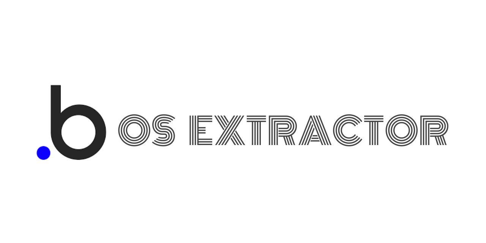

# bubble-os-extractor



This is a script that extracts all the option sets in a Bubble application through the Bubble interface, including their name, attributes (custom and built-in) and options.

It does not include the options' attribute values.

## Output Format

The output of the script is described by the following JSON schema:

```json
{
  "type": "array",
  "items": {
    "type": "object",
    "properties": {
      "name": { "type": "string" },
      "fields": {
        "type": "object",
        "properties": {
          "custom": {
            "type": "array",
            "items": {
              "type": "object",
              "properties": {
                "name": { "type": "string" },
                "type": { "type": "string" }
              },
              "required": ["name", "type"]
            }
          },
          "builtIn": {
            "type": "array",
            "items": {
              "type": "object",
              "properties": {
                "name": { "type": "string" },
                "type": { "type": "string" }
              },
              "required": ["name", "type"]
            }
          }
        },
        "required": ["custom", "builtIn"]
      }
    },
    "required": ["name", "fields"]
  }
}
```

## Usage

1. Copy the entire contents of the `index.js` file.
2. Access the Option Set subtab in the Data tab of the Bubble editor.
3. Open the browser console, paste the copied code and press Enter.
4. Wait for the script to finish executing and copy the output from the console, which should appear as in the image below:

![After executing the script, this is the expected output: "[extract-bubble-option-sets] Output:" followed by the array containing the option sets.](console-output.png)
